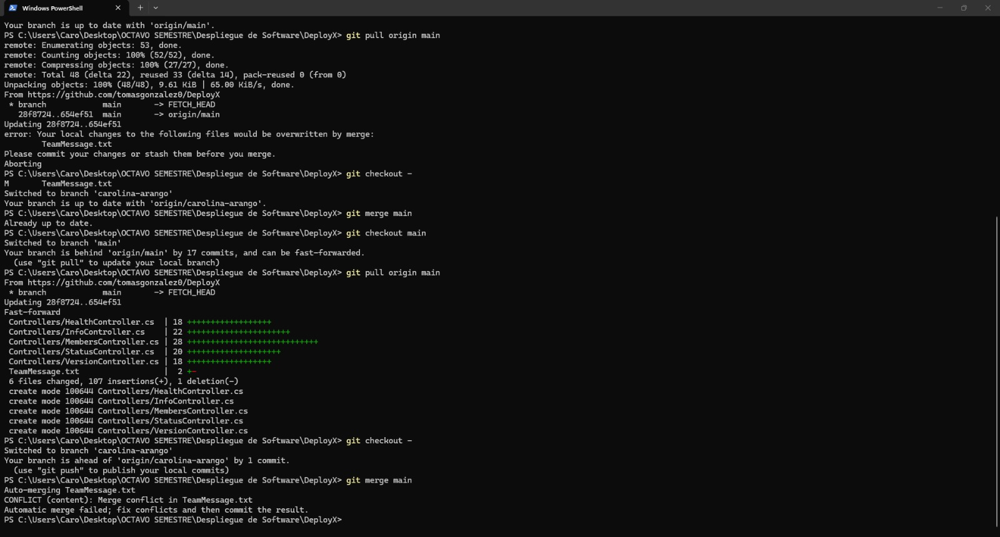
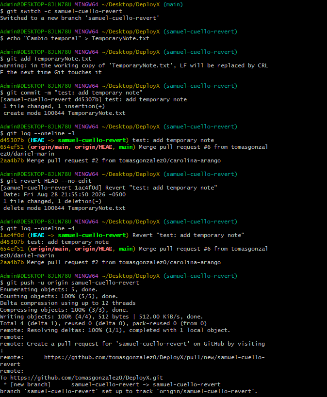
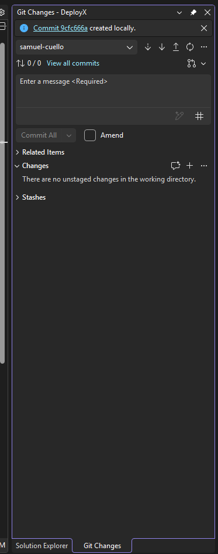
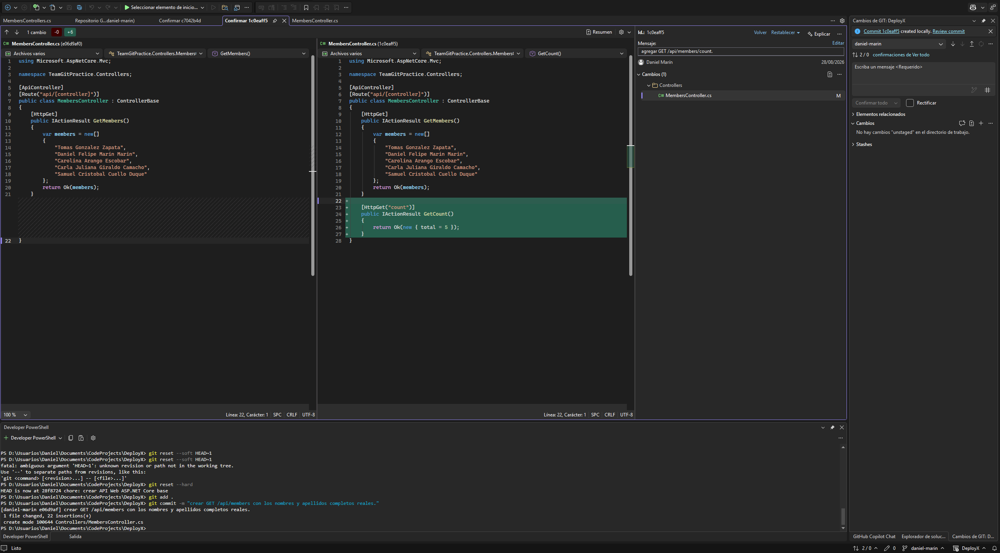
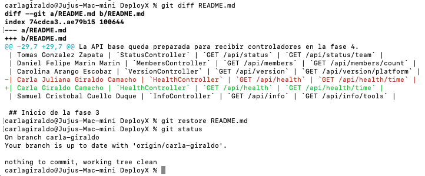
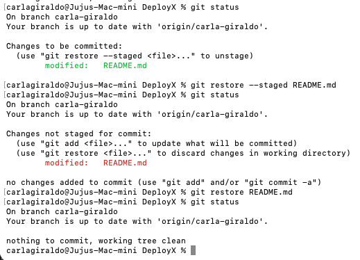

# Evidencias de la práctica
Repositorio: <https://github.com/tomasgonzalez0/DeployX>
## Commits y Pull Requests por integrante
| Integrante | Rama personal | Commit consola | Commit Visual Studio | Pull Request | Reviewer |
| --- | --- | --- | --- | --- | --- |
| Tomas Gonzalez Zapata | `tomas-gonzalez` | `df9ef82` - `feat: agregar endpoint de estado` | `e93895d` - `agregar GET /api/status/team` | [PR #4](https://github.com/tomasgonzalez0/DeployX/pull/4) | Daniel Felipe Marin Marin |
| Daniel Felipe Marin Marin | `daniel-marin` | `e06d9af` - `crear GET /api/members con los nombres y apellidos completos reales.` | `1c0eaff` - `agregar GET /api/members/count.` | [PR #3](https://github.com/tomasgonzalez0/DeployX/pull/3) | Carolina Arango Escobar solicitada |
| Carolina Arango Escobar | `carolina-arango` | `82a964e` - `crear GET /api/version` | `7380032` - `agregar GET /api/version/platform.` | [PR #2](https://github.com/tomasgonzalez0/DeployX/pull/2) | Carla Juliana Giraldo Camacho |
| Carla Juliana Giraldo Camacho | `carla-giraldo` | `b1c8421` - `crear GET /api/health` | `e656cf7` - `agregar GET /api/health/time` | [PR #5](https://github.com/tomasgonzalez0/DeployX/pull/5) | Samuel Cristobal Cuello Duque |
| Samuel Cristobal Cuello Duque | `samuel-cuello` | `7e1296d` - `feat: add GetInfo API endpoint on Info Service` | `9cfc666` - `feat: add GetTools API endpoint on Info Service` | [PR #1](https://github.com/tomasgonzalez0/DeployX/pull/1) | Tomas Gonzalez Zapata |
 
## Conflicto intencional
- Pull Request de resolución: [PR #7](https://github.com/tomasgonzalez0/DeployX/pull/7)
- Rama que resolvió el conflicto: `carolina-arango`- Commit de resolución: `5089a15` - `Fix: resolve team message conflict`- Cambio previo de la fase 6: `97b3790` - `Cambios Fase 6`- Texto final esperado en `TeamMessage.txt`: `Estado del proyecto: preparado para entrega y en validación.`
#### Recuperación de cambios
 `git restore` y `git restore --staged`
 

## git revert
- Rama auxiliar: `samuel-cuello-revert`
- Commit temporal: `d45307b` - `test: add temporary note`
- Commit generado por revert: `1ac4f0d` - `Revert "test: add temporary note"`
 

 
## Evidencias procedimentales
- 
- 
- 
- 
